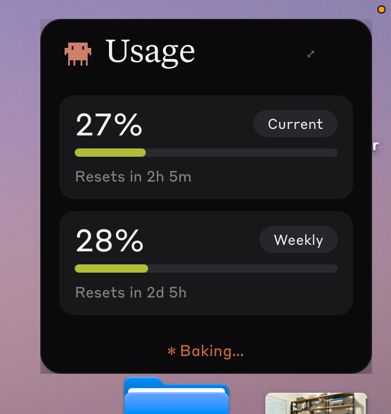
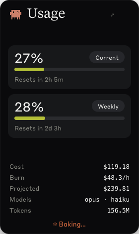

# Claude Usage Widget

A tiny always-on-top **macOS desktop widget** for your live **Claude Code subscription usage** — Current (5h) + Weekly (7d) limits at a glance, with an animated Clawd mascot. A software take on the [Clawdmeter](https://github.com/HermannBjorgvin/Clawdmeter) desk dashboard.

 

## Install — macOS & Linux

It's a standard [Tauri](https://tauri.app) app: you build it from source with `npm run tauri build`. No install script, nothing hidden.

**Easiest — ask Claude Code to do it.** Paste this to your Claude Code:

> Clone https://github.com/everssauro/claude-usage-widget, build it with `npm run tauri build`, and put the app where I can launch it.

You'll see every command it runs.

**Or build it yourself:**

1. **Prerequisites:** [Rust](https://rustup.rs) · [Node 20+](https://nodejs.org) · macOS: **Xcode Command Line Tools** (`xcode-select --install`) · Linux: `libwebkit2gtk-4.1-dev libgtk-3-dev libayatana-appindicator3-dev librsvg2-dev patchelf libfuse2`.
2. **Build:**
   ```bash
   git clone https://github.com/everssauro/claude-usage-widget.git
   cd claude-usage-widget
   npm install
   npm run tauri build
   ```
3. **Run it:**
   - **macOS** (Apple Silicon) → open `src-tauri/target/release/bundle/macos/Claude Usage Widget.app` (drag it to `/Applications` to keep it). A self-built app isn't quarantined, so Gatekeeper won't block it.
   - **Linux** → run the AppImage in `src-tauri/target/release/bundle/appimage/`.

Update later: `git pull && npm run tauri build`.

## Connect your account

- **Have Claude Code signed in on this machine?** It just works — detected automatically.
- **Don't?** Open ⚙ settings → **Account → Sign in with Claude**, approve in the browser, paste the code back. Uses your own Claude (Pro/Max) subscription — **no API key, no API billing**.

## Features

- **Current (5h) + Weekly (7d) usage %** with heat bars, reset timers (and reset clock time), and an **ETA-to-limit** ("limit in 1h 12m") + throttle warning.
- **⤢ expand** → cost / burn rate / projected cost / models / tokens / cache-hit % (via [`ccusage`](https://github.com/ryoppippi/ccusage)) and a **subscription-vs-API-equivalent** value comparison.
- **📌 PiP mode** — floats on top, on every Space, over fullscreen apps (like a video PiP). Toggle off for a normal window.
- **Click the Clawd mascot** → big idle creature; click again to cycle its 13 animations.
- **⚙ settings** — dark / light (Claude palette) theme, 80%-usage notification toggle, plan selector.
- Drag anywhere; remembers its position. **80% macOS notification** so you don't blow your block.

## How it works

- **Usage %** — reads your Claude Code OAuth token (macOS Keychain `Claude Code-credentials`, or the widget's own login) and makes one minimal `/v1/messages` call, reading the `anthropic-ratelimit-unified-*` response headers. Subscription auth, not API-billed.
- **Cost panel** — runs `ccusage@14` against your local `~/.claude` transcripts (offline, only while the panel is open). Needs `node`/`npx` available.

## Credit

This is a software reimplementation of **[HermannBjorgvin/Clawdmeter](https://github.com/HermannBjorgvin/Clawdmeter)** (an ESP32 desk dashboard for Claude Code usage). The concept, the "Usage" screen, and the Clawd pixel-art animations come from there — Clawd animations by **[@amaanbuilds](https://x.com/amaanbuilds)** via **[claudepix.vercel.app](https://claudepix.vercel.app)**. Huge thanks to them for the idea and the artwork. See [`REFERENCE.md`](REFERENCE.md).

> ⚠️ **Not affiliated with Anthropic. Personal / educational use.** Like upstream, this bundles the copyrighted **Clawd mascot** and proprietary **Anthropic fonts** (Tiempos, Styrene B) — used **without permission**. The original code here is non-proprietary, but because of those bundled assets the repo carries **no license** (all rights reserved). **Ships as source only — no installers.** If you fork or copy this, be aware of that. *You have been warned.* 🫡

## Dev

```bash
npm run tauri dev                                  # run with hot reload
cargo test --manifest-path src-tauri/Cargo.toml    # parser/auth unit tests (the gate)
```
