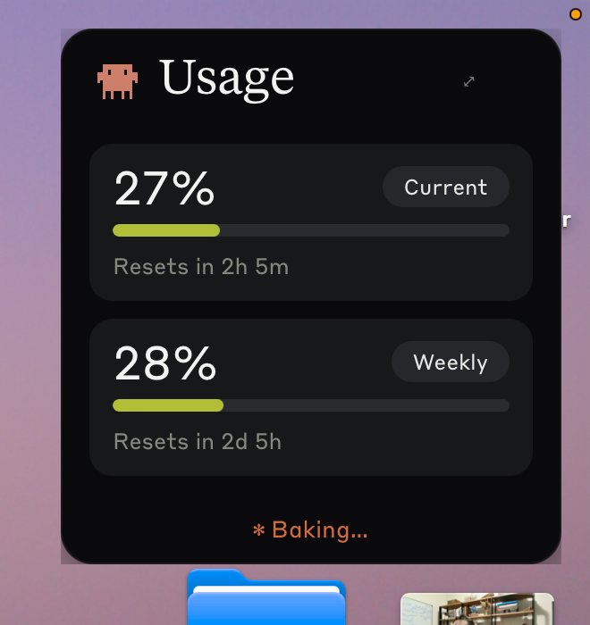
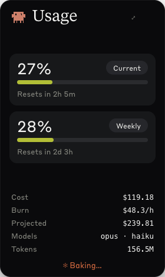

# Claude Usage Widget

A tiny always-on-top **macOS desktop widget** for your live **Claude Code subscription usage** — every limit Anthropic reports at a glance (5h, weekly, and **per-model windows like Fable's**), plus usage credits in real money, with an animated Clawd mascot. A software take on the [Clawdmeter](https://github.com/HermannBjorgvin/Clawdmeter) desk dashboard.

It also opens a **per-project / per-session breakdown** so you can see *where* your usage went — and group projects into named folders (a client, a company, personal work) to find out who spent what.

 

## Install — macOS & Linux

It's a standard [Tauri](https://tauri.app) app: you build it from source with `npm run tauri build`. No install script, nothing hidden.

**Easiest — ask Claude Code to do it.** Paste this to your Claude Code:

> Clone https://github.com/everssauro/claude-usage-widget, build it with `npm run tauri build`, and put the app where I can launch it.

You'll see every command it runs.

**Or build it yourself:**

1. **Prerequisites:** [Rust](https://rustup.rs) · [Node 20+](https://nodejs.org) · macOS: **Xcode Command Line Tools** (`xcode-select --install`) · Linux: `libwebkit2gtk-4.1-dev libgtk-3-dev libayatana-appindicator3-dev librsvg2-dev patchelf libfuse2`.
2. **Build:**
   ```bash
   git clone https://github.com/everssauro/claude-usage-widget.git
   cd claude-usage-widget
   npm install
   npm run tauri build
   ```
3. **Run it:**
   - **macOS** (Apple Silicon) → open `src-tauri/target/release/bundle/macos/Claude Usage Widget.app` (drag it to `/Applications` to keep it). A self-built app isn't quarantined, so Gatekeeper won't block it.
   - **Linux** → run the AppImage in `src-tauri/target/release/bundle/appimage/`.

Update later: `git pull && npm run tauri build`.

## Connect your account

- **Have Claude Code signed in on this machine?** It just works — detected automatically.
- **Don't?** Open ⚙ settings → **Account → Sign in with Claude**, approve in the browser, paste the code back. Uses your own Claude (Pro/Max) subscription — **no API key, no API billing**.

## Features

**The widget**

- **Every window Anthropic reports**, rendered generically: the 5h block, the weekly limit, and **model-scoped windows** (Fable has its own weekly bucket) — a new one appears without a code change.
- **Alert-zone bars**: colour signals state only (safe / amber ≥75% / red ≥90%); the *length* carries the magnitude, and the bound number takes the zone hue so it reads without colour.
- **The binding limit is marked** using Anthropic's own `is_active`, not a guess — exactly one meter ever carries it.
- **Usage credits in real money**, in your account's currency, and only when they're actually spendable: showing "52% used" of a spend cap while you're out of credits reads as "half left" when the answer is "none".
- **ETA-to-limit** ("limit in 1h 12m"), a **▲ %/h trend**, and a **blocked takeover** (red card, sleeping Clawd) when a 5h *or weekly* limit rejects you.
- **⤢ expand** → time-to-limit, cost / burn / projected / models / tokens / cache-hit % (via [`ccusage`](https://github.com/ryoppippi/ccusage)), credits.
- **📌 PiP mode** — floats on top, on every Space, over fullscreen apps. Frosted **glass** throughout (native macOS vibrancy).
- **Click the Clawd mascot** → big idle creature; click again to cycle its 13 animations. Its mood follows your **burn rate**, not your absolute %.
- Drag anywhere; remembers its position — and **returns to it when a display wakes**, instead of being left wherever macOS dumped it.
- **⚙ settings** — notifications (80% / 95% / weekly) and plan. Dark, glass and no Dock tile are decisions, not options.
- **Lives in the menu bar** — no Dock tile. Click the icon to show or hide it, and it comes to whichever Space and screen you're on, right under the icon. Right-click for pin / sessions / settings / quit. **✕** hides; quitting is a menu item.

**☰ Sessions window** (a separate, normal window)

- **Per-project and per-session usage** — tokens (input / output / cache), requests, active time, session count.
- **Four periods**: current 5h, weekly, this month, last month, all time. The 5h and weekly windows are anchored on Anthropic's own reset timestamps, so the table and the widget's bars can never disagree.
- **Named groups** — drag a project row onto a group band to file it under a client or a company; the band totals answer "what did this cost me".
- **Share of plan** — your subscription allocated by each project's measured share. It's arithmetic on a real invoice, not a per-project charge.
- **~API-equivalent** — what those tokens would cost at public API prices, clearly marked as an estimate, with **editable $/M rates**.
- Hover any number for the **per-model split**; hover a row for its full repo path.

## How it works

- **Usage** — reads your Claude Code OAuth token (macOS Keychain `Claude Code-credentials`, or the widget's own login) and calls `GET /api/oauth/usage`, the same undocumented endpoint the official client uses. It returns a generic `limits[]` array (session / weekly / model-scoped) plus credits as real money. Because it's a **GET**, polling no longer spends the quota it measures. If that endpoint ever disappears it falls back to the old `anthropic-ratelimit-unified-*` response headers. Subscription auth, not API-billed.
- **Per-project breakdown** — reads Claude Code's own JSONL transcripts in `~/.claude/projects` directly, deduplicating on `(message.id, requestId)` globally (a streamed message is re-written once per content block with a partial `output_tokens`, so the most complete line wins — first-wins under-counted output by 25% here) and attributing each session to its **git root**. It reconciles with `ccusage` to within 0.07% and is ~10x faster, because it only touches files that could fall in the window.
- **Cost panel** — runs `ccusage@14` against your local transcripts (offline, only while the panel is open, on a 5-minute cadence behind a cache and a kill deadline). Needs `node`/`npx` available.
- **Nothing leaves your machine** beyond the usage call to Anthropic. Groups live in `groups.json` next to the window position.

## Credit

This is a software reimplementation of **[HermannBjorgvin/Clawdmeter](https://github.com/HermannBjorgvin/Clawdmeter)** (an ESP32 desk dashboard for Claude Code usage). The concept, the "Usage" screen, and the Clawd pixel-art animations come from there — Clawd animations by **[@amaanbuilds](https://x.com/amaanbuilds)** via **[claudepix.vercel.app](https://claudepix.vercel.app)**. Huge thanks to them for the idea and the artwork. See [`REFERENCE.md`](REFERENCE.md).

> ⚠️ **Not affiliated with Anthropic. Personal / educational use.** Like upstream, this bundles the copyrighted **Clawd mascot** and proprietary **Anthropic fonts** (Tiempos, Styrene B) — used **without permission**. The original code here is non-proprietary, but because of those bundled assets the repo carries **no license** (all rights reserved). **Ships as source only — no installers.** If you fork or copy this, be aware of that. *You have been warned.* 🫡

## Dev

```bash
npm run tauri dev                                  # run with hot reload
cargo test --manifest-path src-tauri/Cargo.toml    # 39 unit tests — the gate

# reconcile the transcript aggregator against ccusage on real data
cargo test --manifest-path src-tauri/Cargo.toml -- --ignored --nocapture reconcile
```
